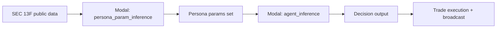
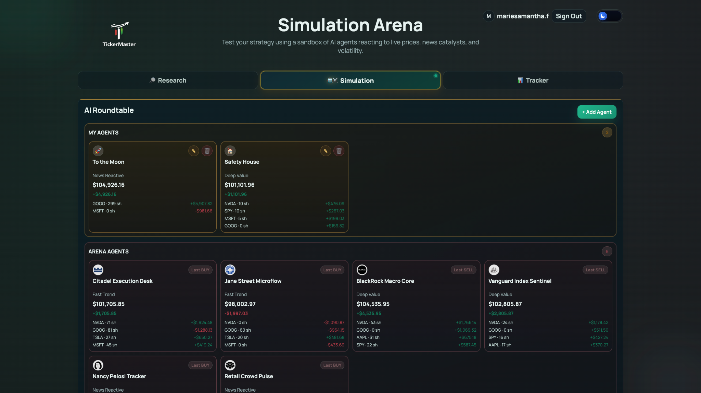
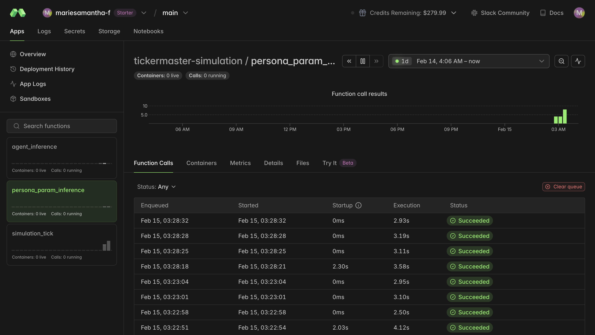
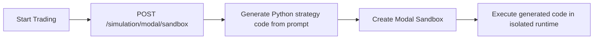
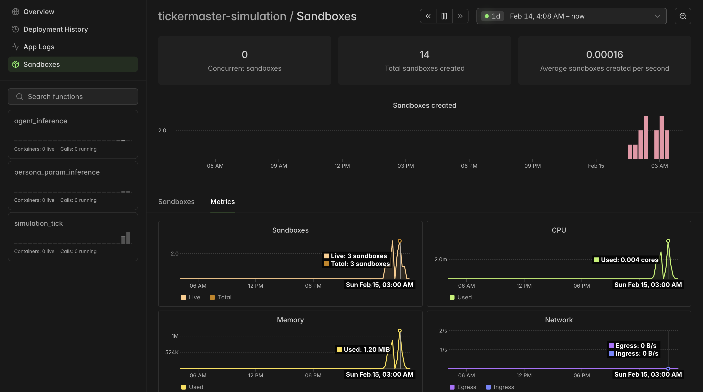

# Modal APIs (Sponsor)

This app uses Modal in two ways:
1. `Inference` (Financial AI agents' persona setup and trading decisions).
2. `Sandbox` (Runs AI-generated simulation code in an isolated cloud runtime).

## 1) Inference

### What it is used for
- We look at public SEC 13F filings for known firms/personas.
- Modal infers each persona's behavior settings from that data.
- During the simulation, Modal keeps deciding what each persona should do (buy, sell, hold, size, confidence, reason).

### Technical details
- Persona parameter inference function: `persona_param_inference`
- Decision refinement function: `agent_inference`
- Key outputs:
  - persona params: `strategy_prompt`, `aggressiveness`, `risk_limit`, `trade_size`
  - decision payload: `side`, `quantity`, `confidence`, `target_ticker`, `rationale`

### Data source
- Public SEC 13F datasets (SEC filings) and shared strategies.

### Flow

### Can be found at
- `simulation/modal_inference.py`
- `backend/app/services/persona_training.py`
- `backend/app/services/modal_engine.py`
- `backend/app/services/simulation.py`

### Screenshots

## 2) Sandbox

### What it is used for
- A Modal sandbox is launched when a user starts a trading simulation.
- The backend first generates Python strategy code from the user/session prompt.
- That generated code is executed inside the sandbox (isolated runtime), and the output is returned.

### Technical details
- API endpoint: `POST /simulation/modal/sandbox`
- Backend launcher: `spin_modal_sandbox(...)`
- Returns:
  - `sandbox_id`
  - `app_id`
  - `dashboard_url`
  - `generated_code_preview`
  - `execution_result_preview` / `execution_error`

### Flow

### Can be found at
- `backend/app/services/modal_integration.py`
- `backend/app/routers/simulation.py`
- `frontend/src/components/SimulationPanel.tsx`

### Screenshot

