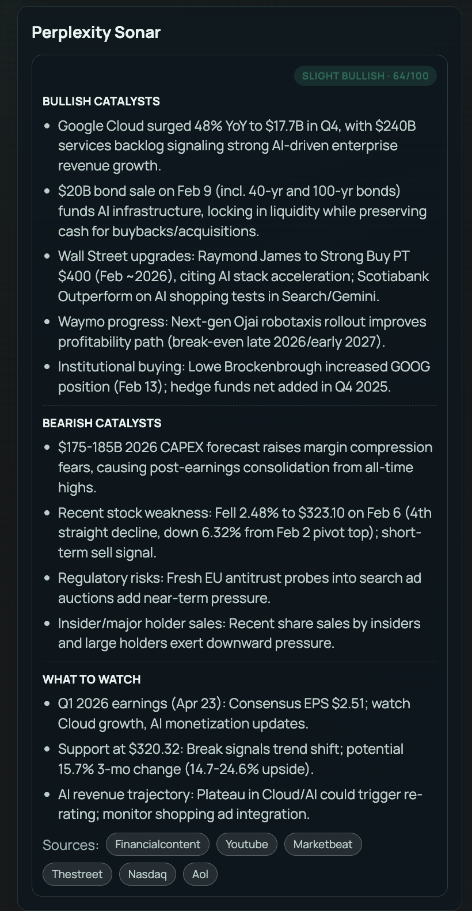
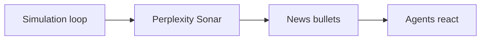
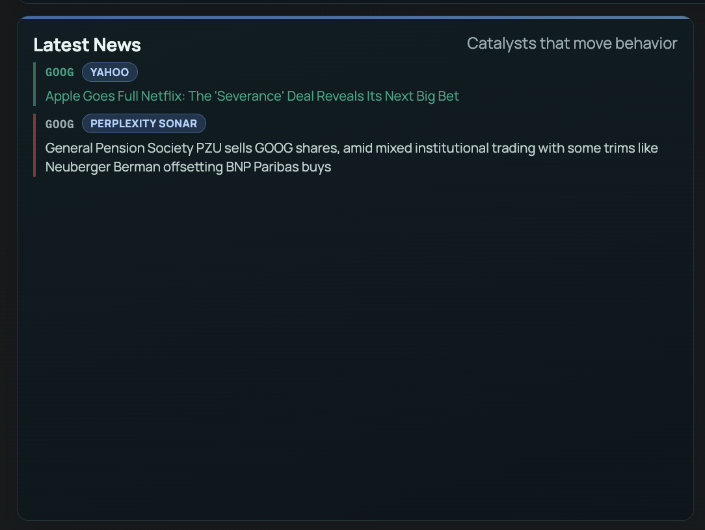
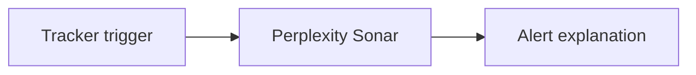

# Perplexity Sonar Sponsor Documentation

TickerMaster uses the Perplexity Sonar API as the "market catalyst reasoning" layer across three product surfaces:
1. Research Workbench (structured bullish/bearish catalysts + citations).
2. Simulation Arena (live catalyst bullets injected into the simulated news stream).
3. Tracker (one-paragraph catalyst investigation when watchlist triggers fire).

## 1) Research Workbench (Primary Sonar Use)

### What it is used for
- Generate a concise, structured catalyst brief for a ticker (last ~7 days):
  - Bullish catalysts
  - Bearish catalysts
  - What to watch next
- Extract and display Perplexity citations as clickable sources in the UI.
- Derive a sentiment score from the Sonar summary and blend it into a composite signal.

### Endpoints and flow
```mermaid
flowchart LR
  A[User clicks Run Research] --> B[POST /research/analyze]
  B --> C[run_research()]
  C --> D[_perplexity_summary()]
  D --> E[Perplexity Sonar API: /chat/completions]
  E --> F[summary markdown + citations URLs]
  F --> G[UI renders Perplexity section + Sources links]
```

### What we store/return
- `summary`: sanitized markdown with headings + bullets.
- `links`: extracted from `citations` (first ~6 URLs).
- `score`: sentiment score derived from the summary text.
- `source_breakdown`: includes a row with `source="Perplexity Sonar"`.

### Code references
- Backend Sonar call + citation extraction: `backend/app/services/sentiment.py`
- Research endpoint: `backend/app/routers/research.py`
- Aggregated ticker bundle endpoints (also call `run_research`): `backend/app/routers/api.py`
- UI rendering of Perplexity section: `frontend/src/components/ResearchPanel.tsx`
- Caching layer (reduces repeated Sonar calls): `backend/app/services/research_cache.py`

### Screenshots


## 2) Simulation Arena (Live Catalyst Bullets)

### What it is used for
- Fetch "latest market-moving headlines or catalysts" as short bullet lines.
- Inject those lines into the simulation's news stream as events with `source="Perplexity Sonar"`.
- The simulation engine uses this news stream to compute a "news bias" signal that influences agent decisions.

### Flow


### Code references
- Sonar news fetch in simulation engine: `backend/app/services/simulation.py`


### Screenshots


## 3) Tracker (Trigger Investigation)

### What it is used for
- When a tracker agent detects a trigger (price/volume/sentiment), we ask Sonar for a single-paragraph explanation:
  - "Explain probable catalysts for this stock move"
- That investigation text is used as context for an alert narrative.

### Flow


### Code references
- Sonar investigation call: `backend/app/services/tracker.py`
